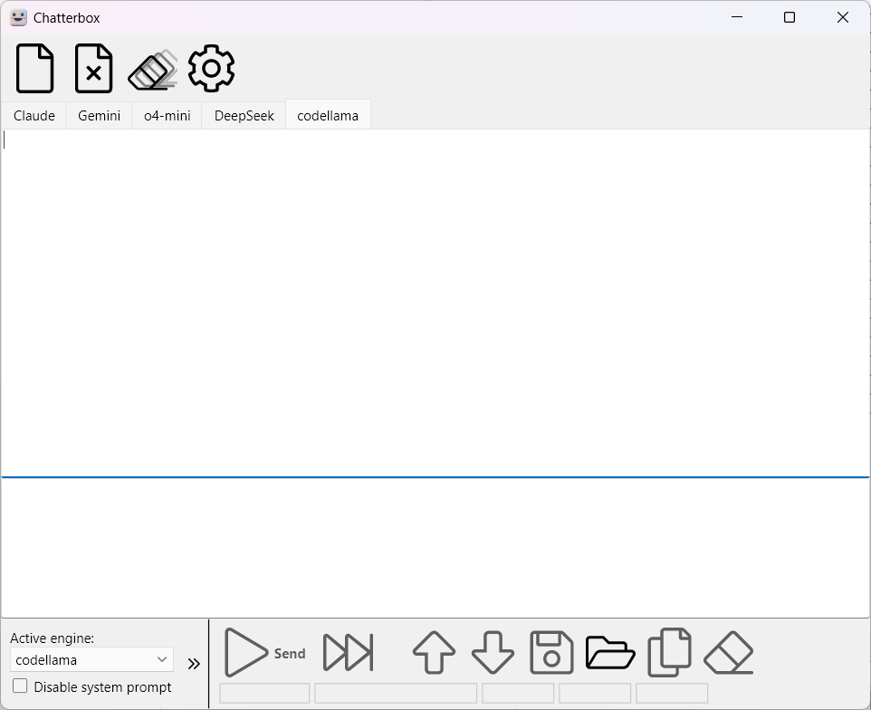
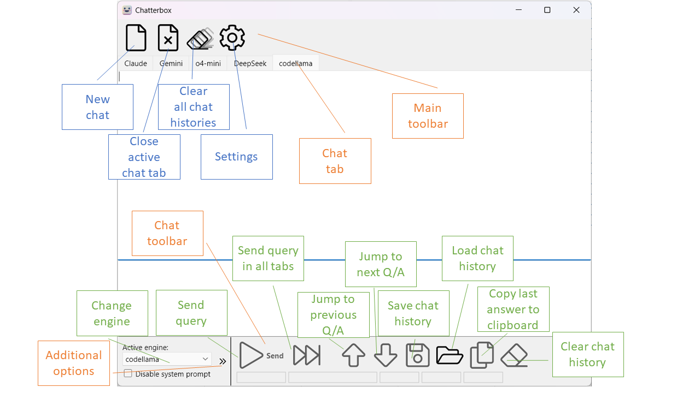
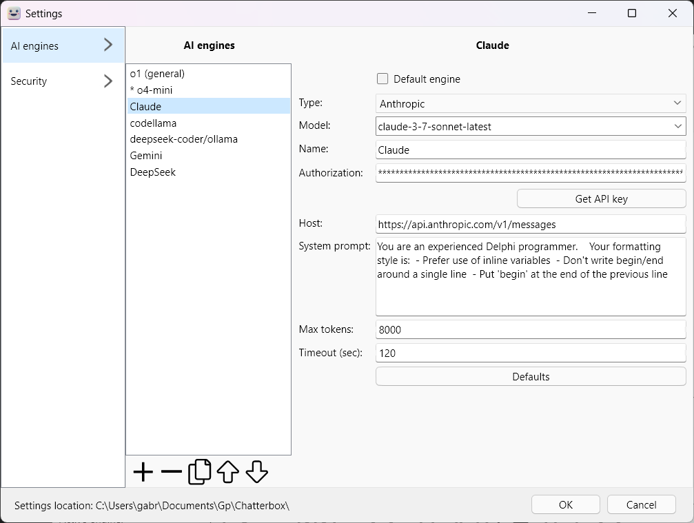

# Chatterbox

Chatterbox is an open-source application designed to enable users to run multiple simultaneous chats with different large language model (LLM) engines.

## Features
- Supports multiple LLM engines:
  - Anthropic (Claude)
  - Ollama
  - OpenAI
  - Google (Gemini)
- Easy-to-use interface for managing multiple chats simultaneously.
- Written in Delphi using powerful open-source libraries:
  - [Spring4D](https://bitbucket.org/sglienke/spring4d/src)
  - [DCPCrypt](https://github.com/Dunhamb4a/DcPCryptV2)
  - [TAES](https://github.com/Delphier/TAES).

## Installation
Chatterbox offers two installation options:

1. **Compile from Source**
   - Ensure you have the following:
     - A fairly new RAD Studio (any version 12 will do).
     - The required dependencies: Spring4D, DCPCrypt, and TAES.
   - Open project in RAD Studio and build.

2. **Download Precompiled ZIP**
   - Download the latest precompiled ZIP file from the [GitHub Releases](https://github.com/gabr42/Chatterbox/releases) page.
   - Unpack the ZIP file and run the executable (EXE).

## Usage
Main Chatterbox window is split into the main toolbar (at the top) and open chat tabs (main part of the window).

The following image describes all the buttons.

To configure engines, go to Settings and add information on the AI Engines tab.

Settings are stored in the Gp/Chatterbox subfolder of the Documents folder. 

### Security warning

API keys are stored encrypted to prevent accidental exposure. This protection, however, is weak as anyone that can access your settings file can also compile Chatterbox and modify it to display your API keys. For a better protection, define Passkey in the Settings. It will be used to encrypt API keys.

## Contributing
Contributions are welcome! If you'd like to contribute:
1. Fork the repository.
2. Make your changes in a new branch.
3. Submit a pull request for review.

## License
This project is distributed under the **CC0 1.0 Universal** license. See the LICENSE file for more details.

## Contact
For support or inquiries, contact [gabr42@gmail.com](mailto:gabr42@gmail.com).

## Repository
The source code is hosted on GitHub: [Chatterbox Repository](https://github.com/gabr42/Chatterbox).
